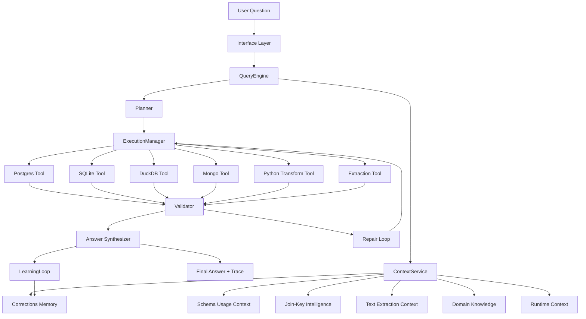
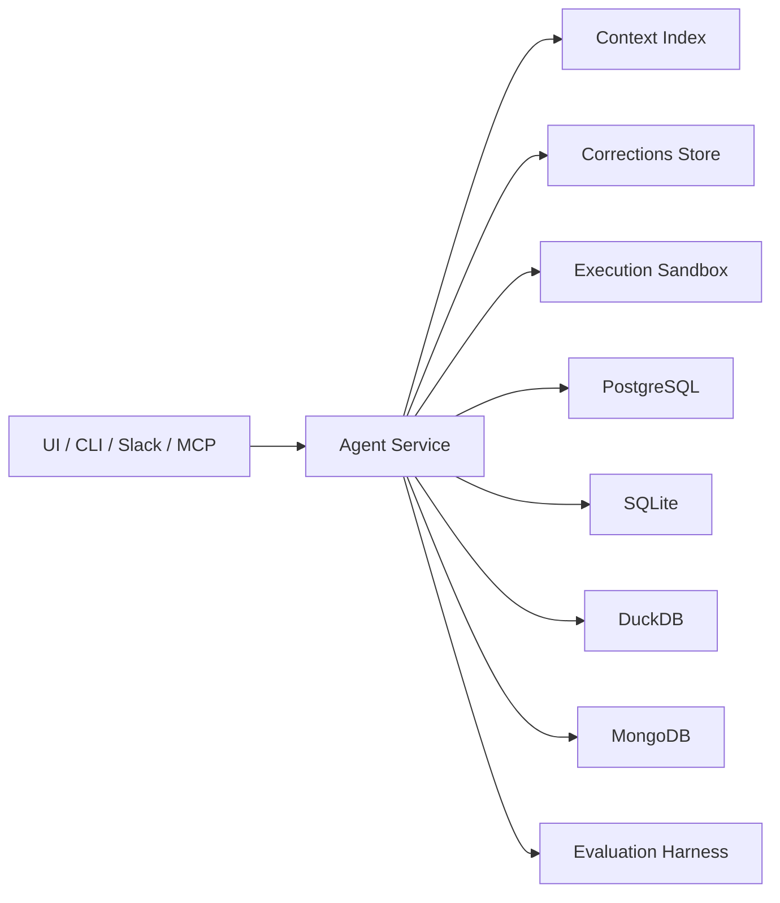

# Oracle Forge Architecture

## Purpose

This document defines the target architecture for a production-grade data analytics agent built for DataAgentBench and the Oracle Forge challenge.

The design goal is not "generate SQL from natural language."

The design goal is:

- retrieve the right context
- choose the right execution path across heterogeneous databases
- normalize messy enterprise data
- validate the result before answering
- learn from failures over time

## Design Principles

1. Context is a product, not a prompt.
2. The runtime should be model-assisted, not model-dependent.
3. Tools should be narrow, typed, and non-overlapping.
4. Every answer must be grounded in traceable evidence.
5. Every repeated failure must become reusable context.

## System Overview

The system has five major layers:

1. Interface Layer
2. Orchestration Layer
3. Context Layer
4. Execution Layer
5. Evaluation and Learning Layer



## 1. Interface Layer

This is the user-facing entrypoint.

Responsibilities:

- receive natural language questions
- display progress
- display final answer and trace
- surface clarifying questions when needed

Possible interfaces:

- CLI
- web UI
- Slack bot
- MCP server interface

The interface layer should be thin. It should not contain business logic.

## 2. Orchestration Layer

This is the core of the system.

### 2.1 QueryEngine

The `QueryEngine` owns the lifecycle of a single user request.

Responsibilities:

- maintain turn state
- call the planner
- request context
- invoke tools
- manage retries
- track budget and iteration count
- collect trace artifacts

The `QueryEngine` is inspired by the central loop pattern used in Claude Code.

### 2.2 Planner

The `Planner` converts the user question into a typed execution plan.

Output should include:

- user intent
- expected answer shape
- required databases
- candidate entities to reconcile
- likely aggregations
- need for text extraction
- need for domain definitions

The plan should be explicit and machine-readable.

Example plan fields:

```json
{
  "question_type": "comparative_aggregation",
  "databases_required": ["postgres", "mongodb"],
  "entities": ["customer", "ticket"],
  "join_keys": ["customer_id"],
  "requires_text_extraction": true,
  "requires_domain_definition": ["repeat_purchase_rate"],
  "expected_output": "ranked_segments_with_correlation_summary"
}
```

### 2.3 ExecutionManager

The `ExecutionManager` converts the plan into concrete tool calls.

Responsibilities:

- execute database-specific subqueries
- decide whether to join in database or Python
- route text extraction
- run intermediate transformations
- return typed intermediate results

It should separate:

- planning
- execution
- validation

## 3. Context Layer

The system should implement six context layers, even if the challenge requires only three.

### 3.1 Layer 1: Schema and Usage Context

Stores:

- schema metadata
- table/collection descriptions
- likely keys
- observed relationships
- representative query patterns

Purpose:

- help the planner know where to look
- reduce tool calls spent on blind exploration

### 3.2 Layer 2: Join-Key Intelligence

Stores:

- canonical entity forms
- format mappings
- normalization rules
- example reconciliations

Purpose:

- solve DAB's ill-formatted key problem explicitly

This should be a structured store, not prose hidden in prompts.

### 3.3 Layer 3: Unstructured Field Intelligence

Stores:

- which fields contain free text
- what structured facts can be extracted from them
- extraction recipes
- examples and edge cases

Purpose:

- solve DAB's text transformation requirement as a first-class capability

### 3.4 Layer 4: Domain Knowledge

Stores:

- metric definitions
- business term meanings
- fiscal calendar rules
- authoritative vs deprecated sources
- dataset-specific caveats

Purpose:

- prevent plausible but wrong answers caused by ambiguous terms

### 3.5 Layer 5: Corrections Memory

Stores:

- failed query
- failure class
- root cause
- fix that worked
- confidence
- dataset and timestamp

Purpose:

- make the system self-improving without retraining

### 3.6 Layer 6: Runtime Context

Stores per turn:

- live schema inspections
- sample values
- current assumptions
- failed attempts
- temporary normalized mappings
- intermediate datasets

Purpose:

- support live debugging and repair loops

## 4. Execution Layer

The execution layer should expose a small, typed tool surface.

### 4.1 Required Tools

- `list_data_sources`
- `get_schema_summary`
- `inspect_table_samples`
- `run_sql_postgres`
- `run_sql_sqlite`
- `run_sql_duckdb`
- `run_mongo_pipeline`
- `normalize_join_key`
- `extract_structured_facts`
- `run_python_transform`
- `validate_answer_contract`
- `read_kb_context`
- `write_correction_memory`
- `get_past_failures`

### 4.2 Tool Design Rules

Each tool should define:

- name
- input schema
- output schema
- read-only/write permissions
- error format
- trace payload

Avoid overlapping tools like:

- two different generic SQL executors
- multiple text extraction paths
- vague "analyze_data" meta-tools

## 5. Validation Layer

Validation is not optional. It is part of the architecture.

### 5.1 Validator

The `Validator` checks:

- query execution success
- row count plausibility
- join cardinality plausibility
- null rates on key fields
- schema compatibility
- output type correctness
- whether the final answer is supported by evidence

### 5.2 Repair Loop

If validation fails, the system must classify the failure before retrying.

Failure classes:

- routing failure
- schema misunderstanding
- join-key mismatch
- text extraction failure
- domain knowledge gap
- aggregation or synthesis bug

Repair strategy:

1. classify failure
2. fetch targeted context
3. modify the plan
4. retry within budget

## 6. Learning Layer

### 6.1 LearningLoop

After a successful repair or user correction, the system writes a structured memory entry.

Memory entry schema:

```json
{
  "query_signature": "repeat_purchase_rate_by_segment_with_ticket_volume",
  "failure_class": "domain_knowledge_gap",
  "root_cause": "active customer was interpreted incorrectly",
  "fix": "use purchased_in_last_90_days definition from domain KB",
  "source_type": "validated_run",
  "confidence": "high",
  "dataset": "crmarenapro",
  "recorded_at": "2026-04-10T00:00:00Z"
}
```

### 6.2 Provenance Rules

Do not trust the model to infer provenance.

Every stored fact should include:

- source type
- source identifier
- timestamp
- confidence

Allowed source types:

- schema
- query_history
- human_annotation
- code_enrichment
- uploaded_document
- runtime_observation
- inferred
- correction

## 7. Evaluation Architecture

The evaluation system should mirror production execution closely.

### 7.1 Trace Schema

For every run, log:

- dataset
- query id
- trial id
- original question
- retrieved context
- plan
- tool calls
- raw queries
- intermediate results
- validation events
- repair attempts
- final answer
- final correctness

### 7.2 Score Layers

Track:

- overall pass@1
- per-dataset pass@1
- per-failure-category performance
- average retries
- fraction of failures recovered
- fraction of failures caught before final answer

### 7.3 Probe Library

Adversarial probes should map directly to architecture stress points:

- multi-database routing
- join-key normalization
- text extraction
- domain definition resolution

## 8. Deployment Topology

Recommended topology:

- one agent service
- one context index store
- one corrections memory store
- database access through MCP or adapter tools
- optional sandbox service for Python execution



## 9. Suggested Codebase Shape

```text
agent/
  core/
    query_engine.py
    planner.py
    execution_manager.py
    validator.py
    synthesizer.py
    learning_loop.py
  context/
    context_service.py
    schema_store.py
    join_key_store.py
    text_field_store.py
    domain_store.py
    corrections_store.py
  tools/
    postgres_tool.py
    sqlite_tool.py
    duckdb_tool.py
    mongo_tool.py
    python_tool.py
    extraction_tool.py
  contracts/
    plan_schema.py
    trace_schema.py
    answer_contract.py
  AGENT.md
  tools.yaml

kb/
  architecture/
  domain/
  evaluation/
  corrections/

eval/
  harness.py
  score_log.json
  heldout/

utils/
  schema_manifest_builder.py
  join_key_profiler.py
  text_inventory_builder.py
  trace_logger.py
  answer_validator.py

probes/
  probes.md

results/
```

## 10. Build Order

### Phase 1

- `QueryEngine`
- trace schema
- PostgreSQL + SQLite tools
- basic schema context
- answer validator

### Phase 2

- MongoDB + DuckDB
- join-key intelligence
- Python merge path
- domain KB retrieval

### Phase 3

- text extraction pipeline
- repair loop
- corrections memory
- full benchmark harness

### Phase 4

- optimization
- adversarial probes
- regression suite
- benchmark submission

## 11. What This Architecture Optimizes For

This architecture optimizes for:

- reliability over demo polish
- measurable improvement over one-shot cleverness
- explicit recovery from failure
- reusable knowledge across runs

It is intentionally designed so that benchmark misses become structured inputs to the next version of the system.

## Final Thesis

The winning agent is a context-and-validation system wrapped around an LLM, not an LLM wrapped around a database.
