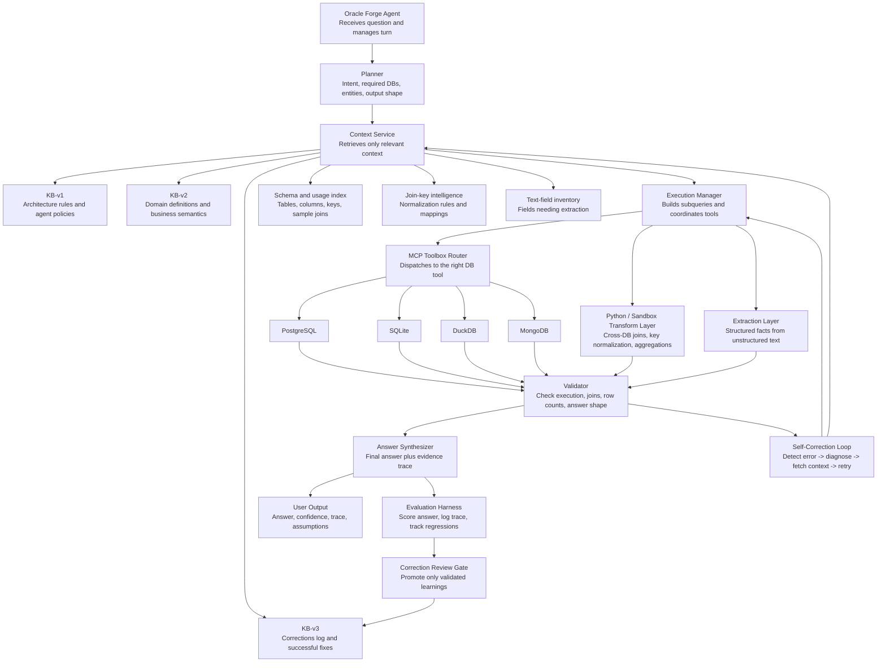
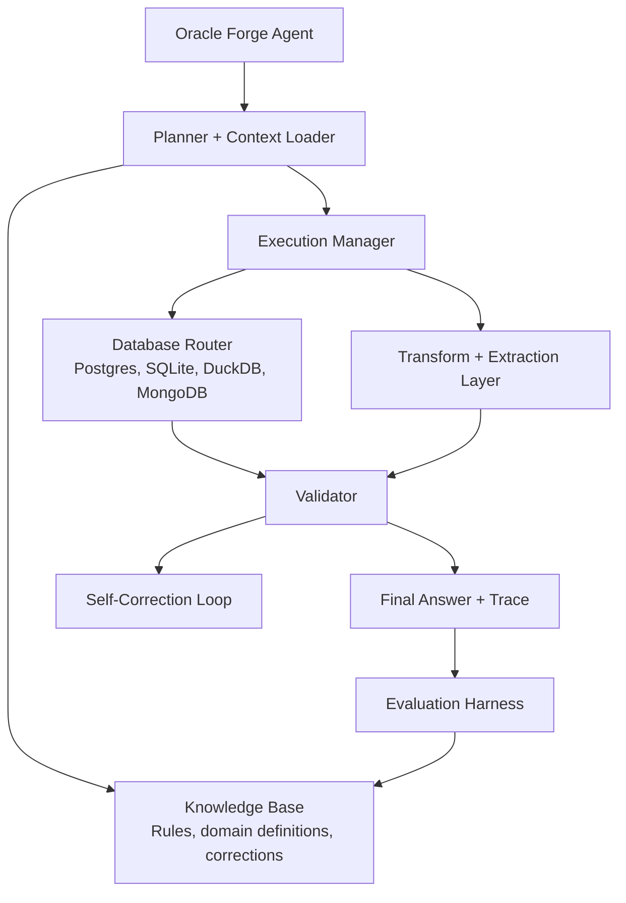

# Oracle Forge Architecture V2

This is the tightened version of the architecture for the final presentation.

It keeps your original strengths:

- context layering
- routing
- self-correction
- evaluation

But it adds the missing runtime pieces required to score well on DataAgentBench:

- a planner
- an execution manager
- a validator
- a transformation layer
- controlled promotion into corrections memory

## Recommended Diagram

## Why This Version Is Better

### 1. It separates planning from routing

Your original version went from agent to knowledge base to router.

That is clean, but too simple for DAB. Many benchmark tasks need:

- more than one database
- a cross-database merge
- a normalization step before joining
- text extraction before aggregation

So the system needs a `Planner` and an `Execution Manager`, not just a router.

### 2. It makes context operational

Your original KB layers were good, but they were still mostly conceptual.

This version adds the context artifacts the runtime actually needs:

- schema and usage index
- join-key intelligence
- text-field inventory

Without those, the model will spend too much time rediscovering obvious facts.

### 3. It makes validation first-class

Self-correction only works well if something concrete tells the system what failed.

The `Validator` should detect:

- empty joins
- row explosions
- invalid aggregation shapes
- unsupported answer formats
- weak evidence grounding

That makes retries targeted instead of random.

### 4. It adds the missing transformation layer

For DAB, the agent will often need to:

- join results from different DBs
- normalize IDs
- reshape data
- compute metrics outside the source DB

That should happen in a `Python / Sandbox Transform Layer`, not inside free-form model reasoning.

### 5. It protects KB-v3 from noise

Your original `Evaluation harness -> update KB-v3` was directionally right.

I’d make it:

`Evaluation Harness -> Correction Review Gate -> KB-v3`

That prevents bad runs, leakage, or one-off mistakes from poisoning memory.

## Simplified Presentation Version

If you want an even cleaner slide for a non-technical audience, use this:

## Exact Box Names I Recommend

For the final diagram, I would use these labels:

1. `Oracle Forge Agent`
2. `Planner`
3. `Context Service`
4. `KB-v1: Architecture Rules`
5. `KB-v2: Domain Definitions`
6. `KB-v3: Corrections Log`
7. `Schema and Usage Index`
8. `Join-Key Intelligence`
9. `Text-Field Inventory`
10. `Execution Manager`
11. `MCP Toolbox Router`
12. `Python / Sandbox Transform Layer`
13. `Extraction Layer`
14. `Validator`
15. `Self-Correction Loop`
16. `Answer Synthesizer`
17. `Evaluation Harness`
18. `Correction Review Gate`

## Minimal Verbal Narrative

When presenting this, I would explain it in one sentence like this:

"The agent first plans the task, pulls the right context, executes across one or more databases, validates the result, retries if needed, and only then returns an answer while logging validated learnings back into memory."

## Recommendation

If your team wants one architecture slide only, use the first diagram in this file.

It is simple enough to explain, but complete enough to justify strong benchmark performance.
